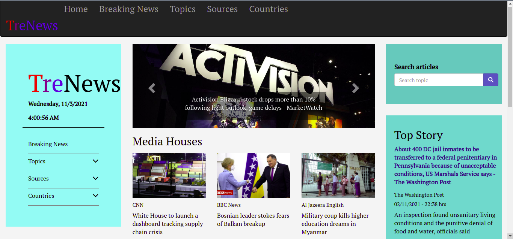

# TreNews ( ```News_API```)
#### This is a project on a python language to implement the News-Api App.

 
 ***Tuesday November 2 2021*** 
#### By **OMOLO LEVY**&trade;


## Project Description
This is an application that will help the user with a list and preview news articles from various sources.
</br>

In this app a user is able to explore various news categories including breaking news, business, sports among others. Users can also check out news articles from specific media houses, and from specific countries. One is able to search topics from around the globe, and for a more refined search, find articles from specific media houses. The app gives the time an article was posted, its source and author, and a brief content description. Tap on article links to read full articles on the source websites.

## Project live sites
  * This is the live [link to the repo ](https://github.com/omololevy/TreNews) <br>
  * This is the live [link to the app ](https://trenews.herokuapp.com/)


## Homepage Demo
The app looks like this: 
  

## Setup instructions
* Create a virtual environment in your project directory through the terminal with the command: <br>
```$ python3.9 -m venv --without-pip virtual```

* Activate the virtual environment:<br>
```$ source virtual/bin/activate ```

* Install pip for installing other necessary python packages:<br>
```$ curl https://bootstrap.pypa.io/get-pip.py | python```

* Install flask module:<br>
```$ pip install flask```

* Clone the program from the [online repo](https://github.com/omololevy/TreNews)
* Click on the <button style="background-color:green;"><a href= "https://github.com/omololevy/TreNews" style= "color:white">code</a> </button> button to clone or download

## The App Structure
~~~
|-TreNews
    |-app/
        |-main/
            |-__init__.py
            |-errors.py
            |-forms.py
            |-views.py
        |-static/
            |-css/
            |-fonts/
            |-images/
            |-js/
        |-templates/
            |-base.html
            |-footer.html
            |-fourOwfour.html
            |-index.html
            |-macros.html
            |-navbar.html
            |-news_list.html
        |-__init__.py
        |-models.py
        |-requests.py
    |-tests/
        |-test_news.py
        |-test_sources.py
    |-virtual/
    |-config.py
    |-.gitignore
    |-LICENSE
    |-manage.py
    |-Procfile
    |-README.md
    |-requirements.txt
    |-start.sh
~~~
## Technologies Used
* Python
* HTML
* JavaScript
* CSS
* Bootstrap
* JQuery
* Flask

## Pending Issues
* The footer is not yet polished to the required state.
* Adjusting the the navbar to work effectively besides the sidebars.

* Therefore, you can make a [pull request](https://github.com/omololevy/TreNews/pulls) to this repo improve it or adjust functionalities.

## Support and contact details
Contact me omololevy@gmail.com
### License
The project is under [MIT LICENSE](https://github.com/omololevy/TreNews/blob/master/LICENSE) 
Copyright &copy; 2021.All rights reserved
  